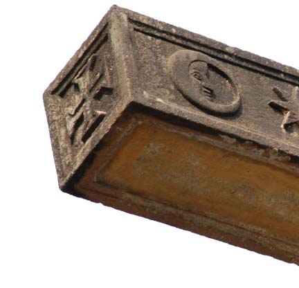
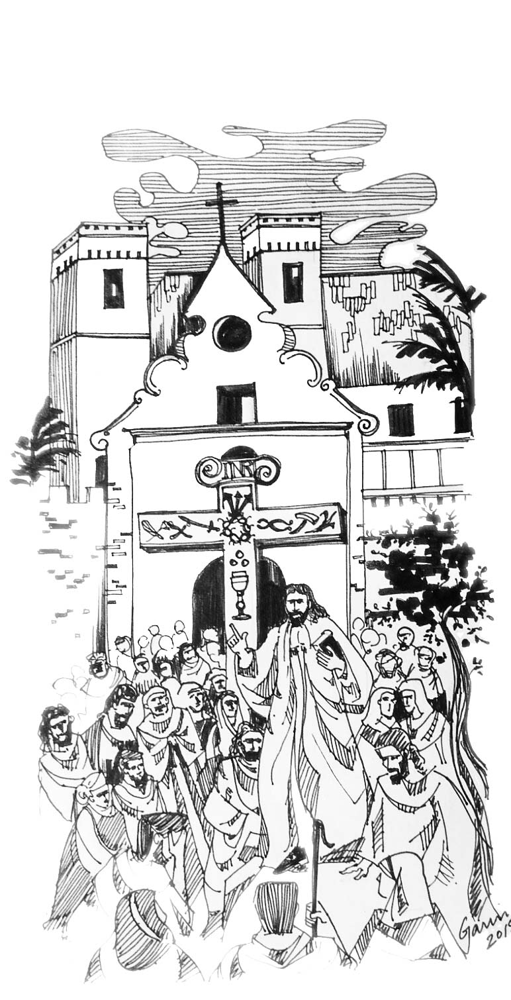

The stone cross in St Andrew's is as much a religious symbol as a
historical relic connecting St Andrew's with its older sister church, Santa Anna.

## History

Sculpted in 1739, the cross originally stood in the compound of Santa Anna,
located near the present Bandra Suburban Railway Station.
This fortified church was the first in what is now called Bandra, and was destroyed
in 1739 to prevent it from falling into the hands of the Marathas.
Fortunately, the estate was bought around 1800 by
Fr Francisco de Mello, a vicar of St Andrew's ensuring the
preservation of the cross.
In 1871 it was set up in the south section of the compound of St Andrew Church.
In 1917-19, the old pedestal was removed and the present
dome-shaped pedestal was built.
The crosses whereabouts between 1739 and 1871 are unknown.

The cross was carved, very likely using local stone from a quarry in
Vile Parle, Dongri or Bassein, probably by local artisans, already
expert in carving temple stone. Often stated to be carved from a single
stone, a monolith, it was constructed in two parts. There
appears a clear joint in the cross just below the two arms on the main
upright.

An interesting local belief among the parishioners is that when some
disaster was about to occur a pink glow would be visible around this
cross.

## Recognition

In recognition of its unique historical significance, the Mumbai Heritage
Commission has designated it a Grade I heritage structure, the highest
classification, and the Church as grade IIA, the next highest classification.

In the words of Dr Paolo Aranha a historian, "your cross is a truly
remarkable monument in terms of symbolism and iconography ... in my own
personal experience I have never come across such a cross ... It is
indeed a great merit of your community and its pastors to have conserved
so carefully such a precious witness of your Christians origins."

## Carved Symbols

The cross bears forty-five carvings on its faces. Of these twenty
symbols on the east face pertain to Christ's passion, the *Arma
Christi* or *Instruments of the Passion*, while the twenty symbols on
the west face are symbols hinting at qualities and virtues of Our Lady.

These symbols were used for catechetical purposes as a means of religious
instruction in the days when books were scarce. One can easily picture
the scene almost 250 years ago. At sundown perhaps, a Jesuit padre
gathered at the base of the cross with a crowd of the faithful. He uses
the detailed sculpted symbols, one after another to lead his rapt
congregation through the passion and death of our savior, and the many
virtues of Mary His mother.

There are three other sculptings on the cross. The *Titulus Crucis*,
attached to the top of the cross on both faces, INRI, *Iesus Nazarenus
Rex Iudaeorum*, inscribed in Latin, Greek, Hebrew, or Aramaic. The cross
sculpted at the end of each arm is the Cross of the Order of Christ, or
the Cross of Portugal. This cross was also displayed on the sails of the
Portuguese caravels, carracks and other ships involved in the
exploration of the seas. And finally, at the base of the east face, is
carved the date 1678.

