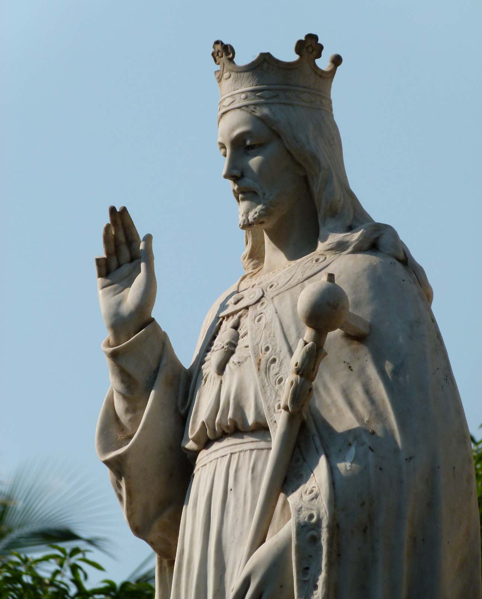
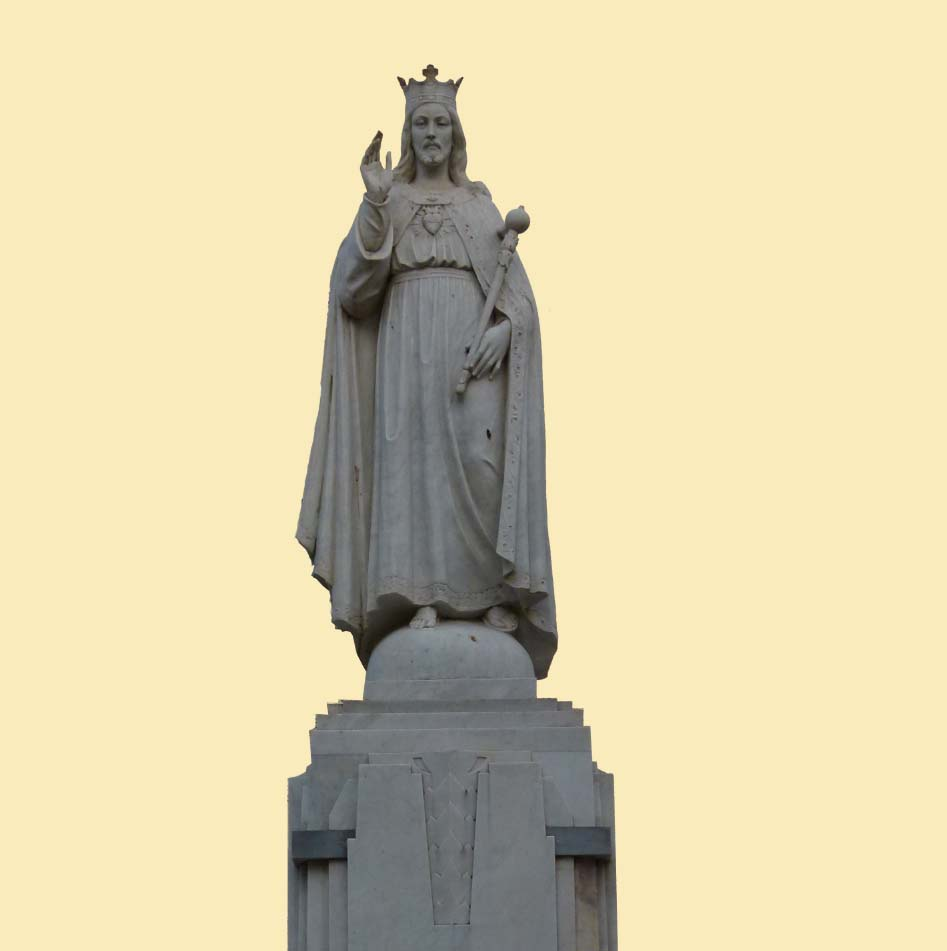
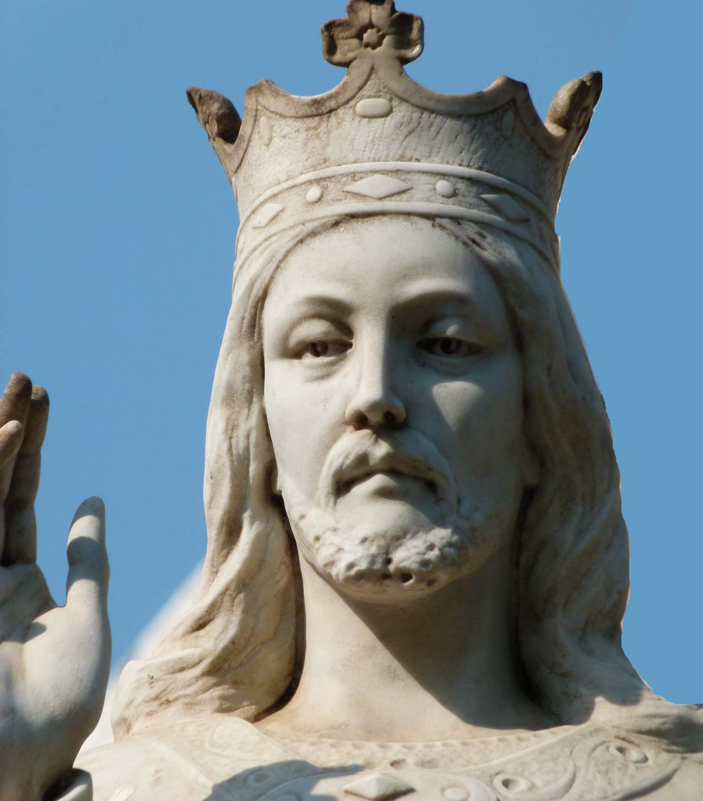
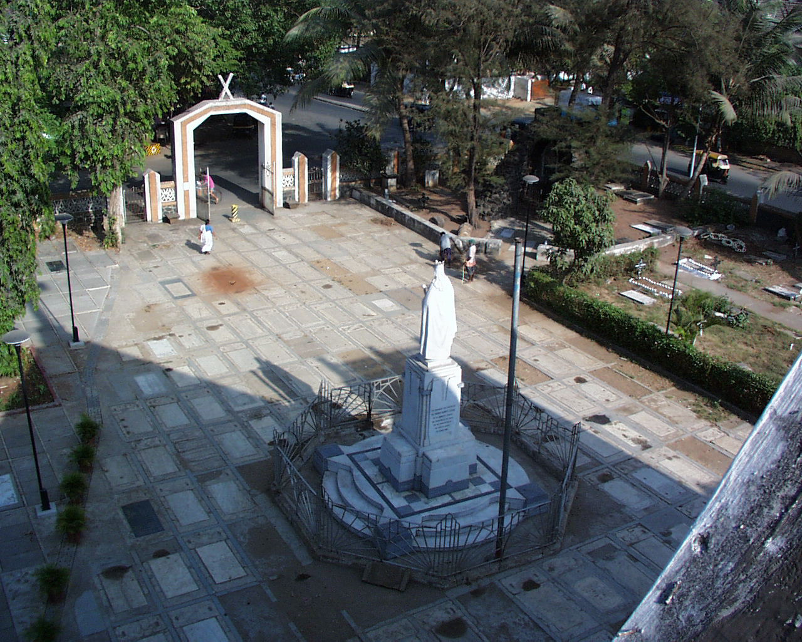

# Christ the King Edifice

Around 1932, a petition was made by a delegation led by John Netto, a
community leader, along with several prominent members of the parish to
the Archbishop of Bombay, to dedicate Bandra to the Immaculate
Conception. After some discussion it was agreed that it would be more
appropriate to dedicate the town to Christ the King. Preparations then
began for this momentous event.

A parishioner, Lourdes Fernandes (later, Netto), was selected to design
the edifice. She prepared three models of Christ to be used for the
installation. One showed Christ regally seated, the other showed Him
standing with both arms outstretched, and the third showed Him with one
hand raised in benediction and the other holding the *globus cruciger*
"cross-bearing orb", a symbol of authority that symbolises Christ's
dominion over the world. This last was chosen and today graces the front
compound of our church. The art deco pedestal was designed by Robert
Athogias. Sadly the marble cross atop the globe has since broken off, as
has part of Christ's little finger. The imposing statue was then
sculpted in Italy from the best Carera marble and transported to India.
Place was made in the front of the church by relocating the stone cross,
dated 1761, to the north side of the compound.

The dedication of Bandra to Christ the King on February 3rd 1935 was a
magnificent affair. The town was packed with tens of thousands of people
from parishes far and wide. The three vicars, of the parishes of St
Andrew, St Peter and Mt Carmel along with their parish priests hosted
the event. The Apostolic Delegate, the Most Rev. Dr Leo Kierkels,
Archbishop of Salamis was the Patron along with the Archbishop of
Bombay, Rev. Dr Joaquim Lima. SJ. The Very Rev. Dominic de Sa, Vicar of
the Parish of St Andrew, addressed the congregation and there were
addresses by several prominent parishioners. The service was broadcast
on State radio.

