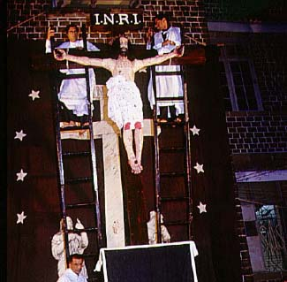
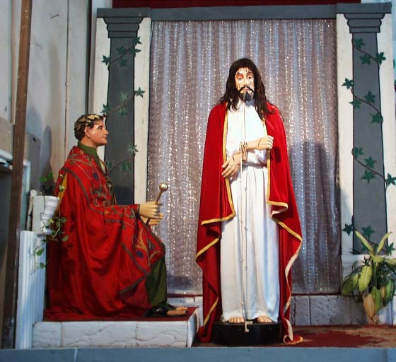
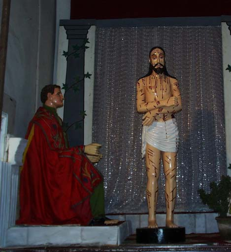
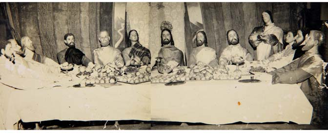
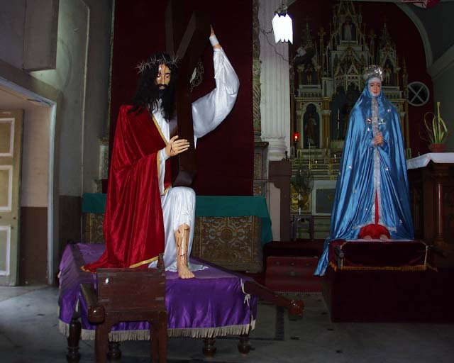

Passion Plays in various parts of the Christian World are the means of
bringing to life the story of Jesus' suffering and death; they are
dramatic reminders of the way in which redemption was won for all
mankind. In St Andrew's the Santos Passos, like the Lenten observances
also enacted in Bassein from 1552, take place in the season of Lent. In
keeping with its koli antecedents it is the community of Chimbai that
even today administers to the Passo and other Lenten traditions.

The chronicles of the Church of St Andrew describe the various phases
through which these tableaux have passed. At one point the comment made
is: "Modern trends might make for the discontinuance of this
melodrama..." However today the fervor has not diminished one whit.

The reenactment of 'Veronica wiping the face of Jesus' takes place
each year in the church compound during the season of Lent. The platform
bearing the statue of Christ carrying His Cross is carried in
solemn procession around the compound. Alongside is another platform
with Mary, in traditional dress. When the procession reaches the
compound of the Oratory, the ceremony of 'Veronica wiping Jesus'
face' takes place, and when she turns to display to the throng of
faithful the miracle whereby the face of Jesus appears on the moist
cloth she used to wipe his bleeding face, she sings a plaintive and
haunting verse in celebration.

In earlier centuries, before modern traffic prevented it, the procession
proceeded from the church compound, down Waroda Road and through Ranwar
Village, and the assembly and 'wiping Jesus' face' took place in an
open ground in Ranwar Village. A present-day reminder of this custom is
the arterial Veronica Street, that still wends its way through the
village.

During each Sunday in Lent, a different enactment from the Passion of
Christ is set up in front of the Crucified Christ side altar and at an
evening service the curtain over the scene is solemnly drawn to reveal
the Savior, which is followed by a sermon in Marathi.
On Maundy Thursday another tableau is recreated, showing slightly larger
than life statues of Christ and His Apostles in dignified solemnity
representing the Last Supper at which the Eucharist was instituted.
Hot Cross buns and various seasonal fruit including the distinctly
pungent smelling cashew are on sale, thus creating a make-believe
participation in this special meal. On sale also are those beans with a
'special Lenten flavor', *gonth vaal*, along with the dessicated
berries, our *boras*.

