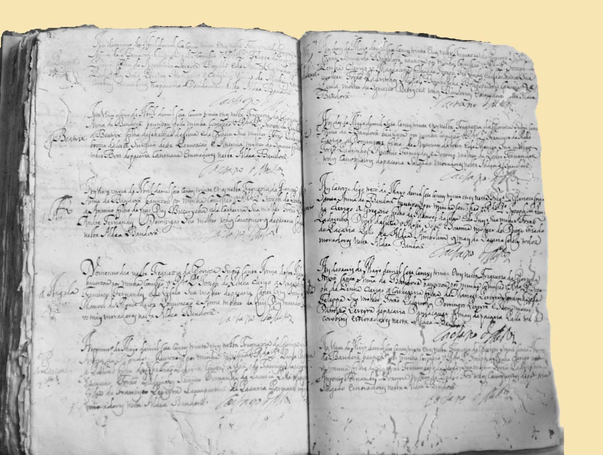

The earliest register pertains to Portuguese Bandra. It appears that
this single baptismal register was brought to the parish of St Andrew
and deposited there after the closure of St Anne's around 1737. The
baptismal register gives the date of baptism but not the date of birth.
Baptisms in the volume commence in December 1715 and end in March 1737.
This church was closed down in July 1737 due to the Maratha invasion of
Salsette (in April 1737) and the ensuing siege of Bandra.

Baptisms after July 1737 were performed in St Andrew's which remained
the only functioning parish church in Bandra. The parish of Santa Anna
till July 1737 looked after the pakhadis of Bandra which consisted of
cultivators, toddy tappers etc, but excluded the *koliwadas* (*koli*
settlements); all the koliwadas were under the jurisdiction of
St Andrew's.
The Marriage Register starts with the year 1750. Marriage Registers up
to the first half of 1915 are in Portuguese, thereafter in English. It
is only in 1888 that provision is made for the ages and signatures of
the bridal couple. Previously there were signatures only of the Vicar
and the witnesses frequently stating their ages and villages.

The Burial Registers commence in 1853. There are several gaps in these
registers too.

