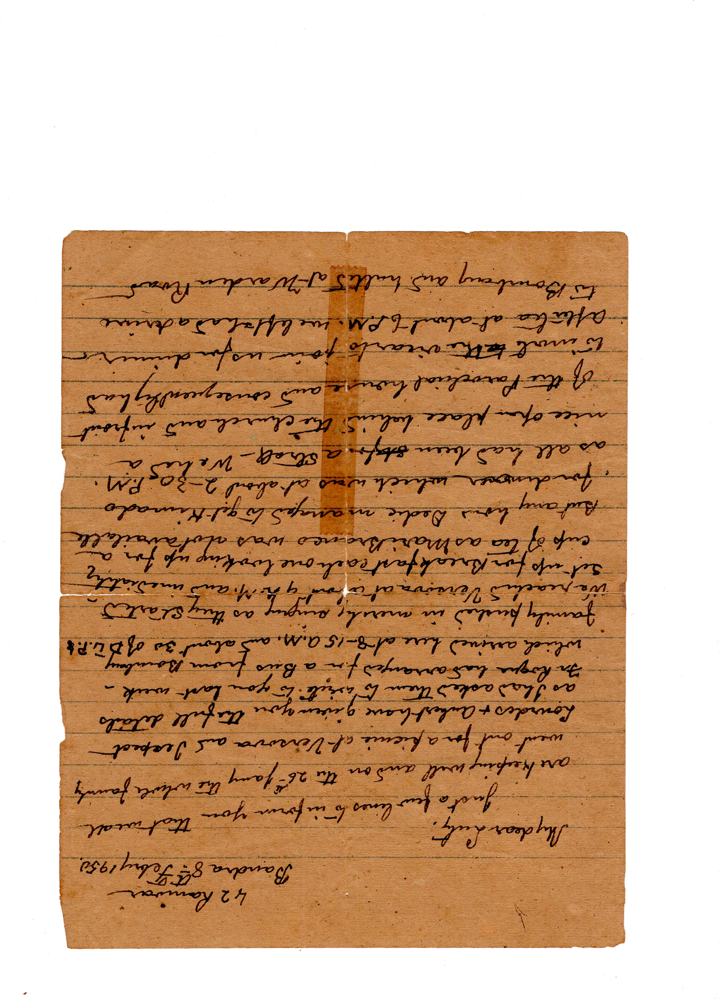
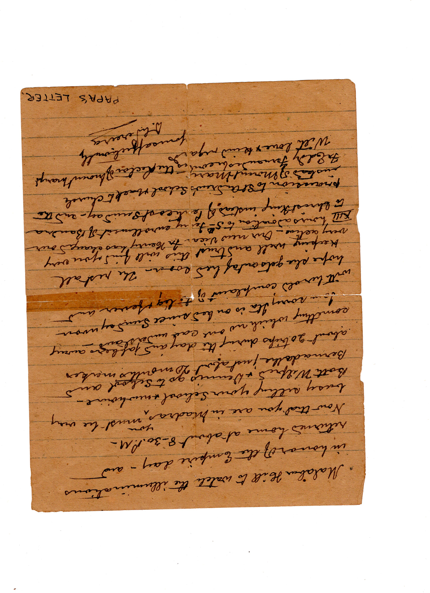

::: transcribed

::: page

|                                             42 Ranwar
|                                 Bandra 8th Febry 1950
|
| My dear Luty,
|         Just a few lines to inform you that we are all
| keeping well and on the 26th Jany the whole family
| went out for a picnic at Versova and I expect
| Lourdes and Aubert have given you the full details
| as I had asked them to write to you last week.
| Fr Roque had arranged for a bus from Bombay
| which arrived here at 8.15 A.M..and about 30 of DLP’s
| family pushed in merrily singing as they started.
| We reached Versova at about 9 A.M. and immediately
| set up for breakfast each one looking up for a
| cup of tea as MariBranco was not available.
| But anyhow Dedic managed to get kimado
| for dinner which was at about 2.30 P.M.
| as all had been for a stroll. We had a
| nice open place behind the Church and in front
| of the Parochial house and consequently had
| to invite the vicar to join us for dinner.
| After tea at about 6 P.M. we left and had a drive
| to Bombay and halted at Warden Road

:::

::: page

| Malabar Hill to watch the illuminations
| in honor of the Empire Day - and
| returned homa at about 8.30 P.M.
| Now that you are in Madras you must be very
| busy setting your school and new house
| Both Wilfred and Denis go to school and
| Bernadette just about 20 months makes
| about 20 trips during the day and jabbers away
| something which no one can understand.
| I am sorry Ita is in bed since Sunday noon
| with her old complaint of the leg and fever
| and hope she gets out of bed soon. The rest all
| keeping well and trust this will find you very
| very active. Our new Vicar Fr Henry has changed our
| XII hours adoration to 5th Febry, enrollment of Bandra
| to Christ the King instead of Pentecost Sunday - and the
| procession to St Andrew’s School and back to Church
| instead of Mount Mary’s
| Fr Eddy Fernandes becomes the Rector of Mount Marty’s.
| With love and kind regards,
|                                       yoursaffectionately
|                                               D.L. Pereira
|
|                                              PAPA’S LETTER

:::

:::
