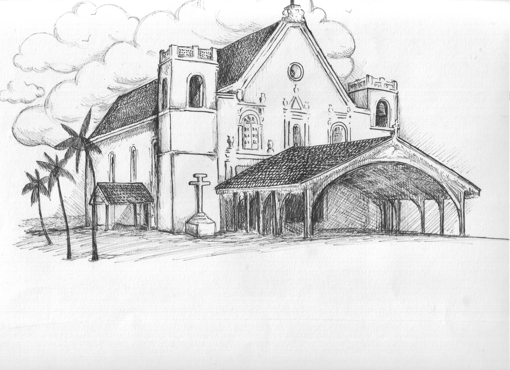
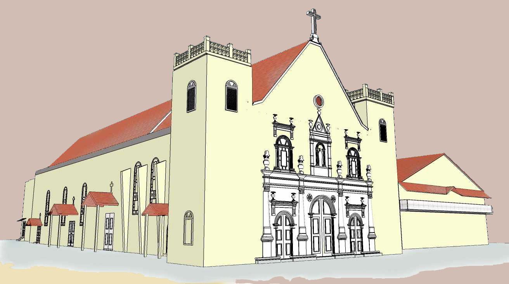
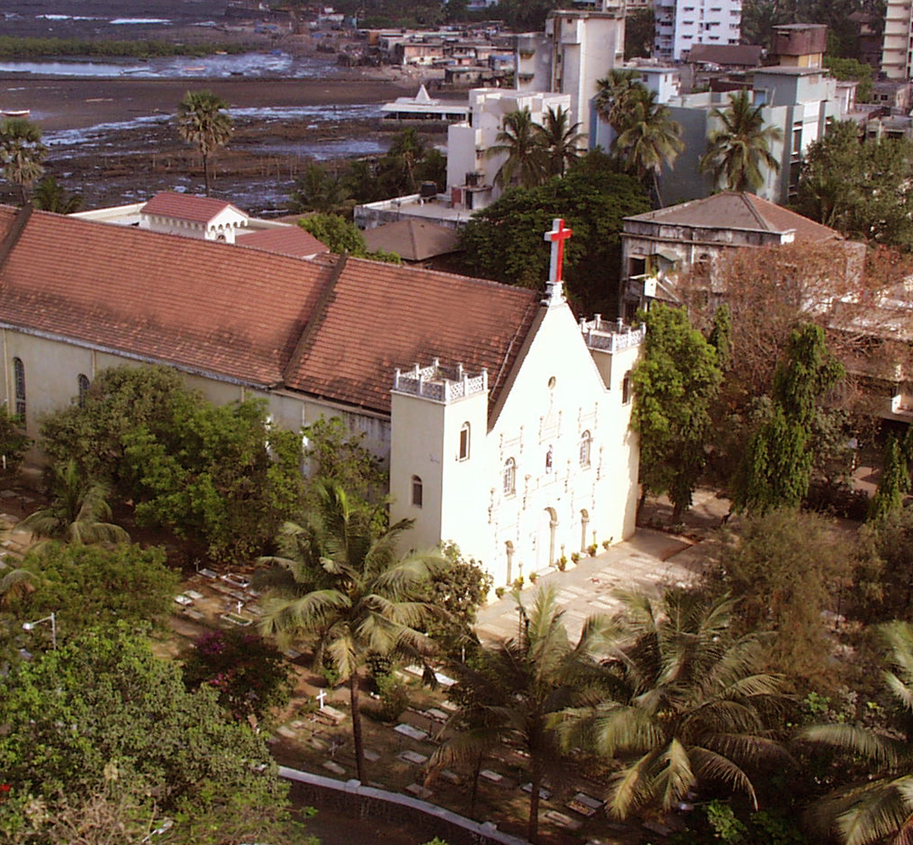

Twice every year, as winter gives way to the swelter of summer, and again when
the monsoon damp begins to dry out, the regulars at morning Mass at the Church
of St Andrew are privileged to witness a gradual, wondrous traverse.
As the sun rises in the sky far beyond the Bandra Railway Station, its rays
flood through the skylight above the choir loft of the Church of
St Andrew and fall like a spotlight on the main arch between the gilded side
altars.

Each week, as if manipulated by a divine stagehand, the luminous circle glides
steadily across the span. Finally, on the morning of the equinox, on March 21
and September 22, at 7 o'clock, the spotlight locks in on the main attraction:
the simple white-washed cross that forms the centerpiece of the arch.

This manmade miracle has been a bi-annual event for four centuries, surviving
plagues, cyclones, a structural extension and the eruption of towering buildings
all around. It serves as a reminder to the faithful that the ancient structure
in which they worship is the embodiment of both human wisdom and heavenly
design.

To appreciate just how long the Church of St Andrew has
dominated the Bandra shoreline, it is worth recalling that it is about 50 years
older than the Taj Mahal in Agra. A recently installed plaque on the front wall
of the structure says, perhaps too boldly, that it was built in 1575. Though the
Church of St Andrew is Bandra's oldest standing church, it was not its first.
That honor went to the Church of St Anne, a sanctuary and strategic
fortification, built around 1575. The Church of St Andrew as it stands today was
probably built around 1595,
perhaps replacing a more rudimentary structure that had been in turn chapel and
hermitage.

In 1739, the British rulers of Bombay, with the assent of the Portuguese
Captain-General, destroyed St Anne's and its fortifications to prevent it
serving as a base for the Maratha forces that then
occupied Salsette Island.

For the next 114 years, the Church of St Andrew served as Bandra's mother
church, until a series of quarrels over jurisdiction and the desire for autonomy
led to the formation of other parishes:
St Peter's in 1853, and Mount Carmel's (which splintered away from
St Peter's) in 1891.

In the four centuries since its construction, the Church of
St Andrew has witnessed the evolution of Bandra from a pastoral settlement of
farmers and fishermen into Bombay's most desirable neighborhood. It has become
the preferred address of some of India's most affluent people and most glitzy
commercial establishments, with motor access to the island secured by both a
causeway and a snaky sealink across the bay.

The changes would surely have stunned the man who was the most assiduous
chronicler of Bandra's development during the first 300 years of St Andrew's
existence. Braz Fernandes, whose grave lies just outside the shrine's southern
wall, could barely contain his enthusiasm for his hometown when he wrote Bandra:
Its Religious and Secular History in 1927. In his introduction, he waxed
eloquent about Bandra's beautiful location on the tidal creek, offering "one of
the finest panoramas on this coast"; Bandra Hill, "dotted with palatial
buildings and crowned with the chapel of Our Lady of the Mount"; the Bandra
Fort, built in 1640; and the "wide stretch from Land's End to Bandra \[that\]
form a graceful vista against the background of the great chain of the Western
Ghauts".

The establishment of regular train services in 1867 had much to do with
propelling Bandra's growth. "The people of the crowded city of Bombay were
driven to seek more light, purer air, and greater freedom" in Bandra, he wrote.

But Bandra wasn't home to only the affluent. Fernandes also took note of the
town's more humble folk, who lived in "huts and hovels; houses huddled together;
\[on\] narrow streets \[with\] resorts of cattle, sheep and pigs". He also
mentions another animal, as he speculates about the possible origins of the
town's name. "A.story is that the inhabitants of the place were so ugly in
appearance that the Mohammedan \[rulers of Bombay\] called them bundars,
monkeys". (More prosaically, it's quite likely that Bandra took its name from
the bunder, or jetty, that probably stood somewhere near the site of the present
Jain temple.)

Despite his obvious pride in Bandra, by the end of his 133-page book, Fernandes
was already wary of the changes. "Today Nature has yielded to the hand of man;
on those verdure-clad slopes, the palm-fringed shores and the wide rice-fields
have risen palaces and mansions, and yet Bandra seems to have outgrown". He
complained (90 years ago), "The house famine is acute".

Not surprisingly the Church of St Andrew gets an entire chapter in his book,
since it was, after all, "the oldest building now standing in Bandra". But of
course, Fernandes was by no stretch the first person to write about the church.

Among the earliest mentions of the structure is in the Account of the Parish of
St Andrew, situated in the same village of Bandra, which appeared in the annual
Jesuit Letter to the Order's headquarters in Rome in 1669, about seven decades
after the church had been built.

"On the edge of this village of Bandra, next to the maritime beach, is the
church known as St Andrew of the Kolis" or Santo Andre dos Colles, as it is
referred to in the Portuguese letter. The church was built with materials that
were among the finest in the region, the letter said, and though the poverty of
the parishioners did not allow extravagant ornamentation, it was by no means
unimpressive.

"The main altar is majestic and speckled" with paint imitating marble "with its
retable parts in gold, the twelve Apostles serving as its columns and St Andrew
having the prominent place," the letter said. "It has two collateral altars: in
one is a Holy Crucifix of much note; and in the other is Our Lady, known as 'of
the Navigators'." It added, "Towards the expenses of its altars, the Kolis spend
liberally within the confines of their poverty."

Over the centuries, the church has undergone several changes: it has been
repaired and enlarged and strengthened and the majestic main altar, which fell
prey to termites, has been replaced in the last century by an equally impressive
one.

Through the years, the shrine has provided refuge for its parishioners that has
been both spiritual and physical. In the year 1931, for instance, when a cyclone
threatened, one old-time parishioner recalled that the worshippers flocked to
the church, where their vicar, Fr Dominic de Sa "in flickering candlelight led
them in reciting the rosary and other prayers while, with lightning and thunder,
the storm raged outside, until, miraculously, the storm abated".

But more than the stoutness of its walls, the Church of St Andrew has endured
because of the devotion of its parishioners. That was evident from the early
days of the formation of the parish, when the Jesuit letter made it a point to
note the piety of the younger members of the church. "They have as a habit, and
obligation, to gather every afternoon in this church to sing the Christian
Doctrine, wherein the translator always assists, and then the Hail Mary near the
door of this church, and those who live further away \[sing\] at the same time
near the \[votive\] Cross that they have in their Koliwada, and today one finds
many of these \[young ones\] with seven or eight years of age who have memorized
three or four chapters," it said.

It's a sentiment that the vicar, Msgr George Fernandes reiterated in 1966. He
noted that the Church of St Andrew was not "bricks and mortar alone" but existed
"in the hearts and homes of all the good people of the parish by their shining
example, fervent prayers, wonderful cooperation and generous self-sacrifice."

With grace and devotion, many more equinoxes will follow.

