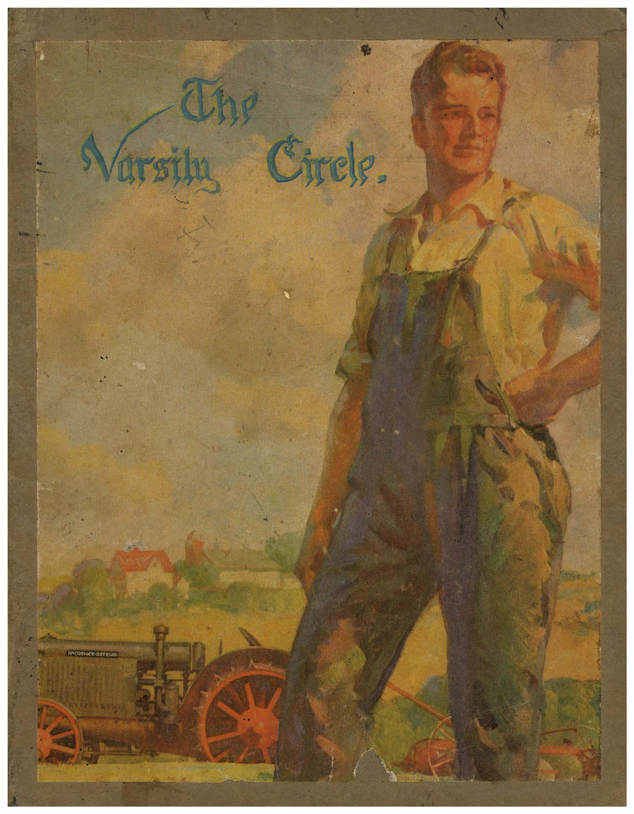

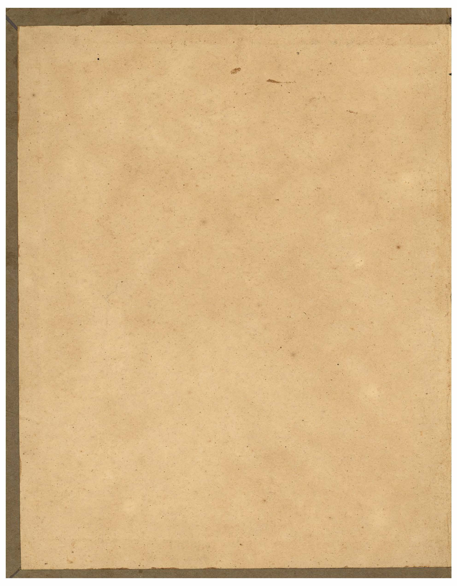

January 1933

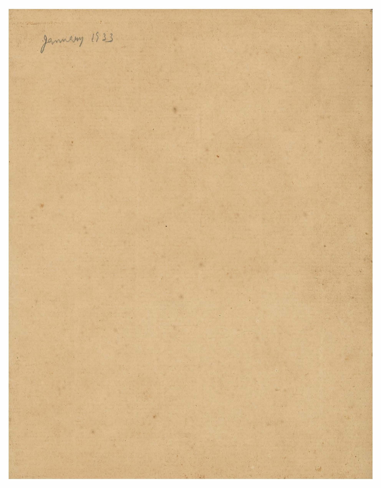

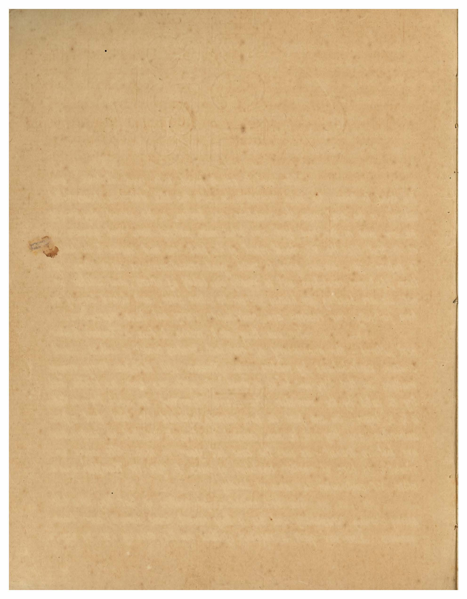

## The Varsity Circle

"The road to hell is paved with good intentions", and
the road to heaven too must necessarily be, with this little distinction however, that
whereas in the first case the sesolutions are broken, in the second they are kept.
We are now in the New Year and what more natural than that glancing back
at its past life the V.C should repent of it's past sins and resolve to do better
in future. Yes, we are going to make good resolutions -- a whole string of
them, but our resolutions will be mostly on behalf of others, and, whether or
not we are heading for heaven -- or the other place, will depend largely on
how faithfully our readers and contributors carry out the resolutions.

For one thing we'll resolve to have a Readers Number
next March -- the anniversary of our last Readers Number,-- which will
contain  contributions by readers only. Readers will therefore kindly arrange
matters so that they will be "in a mood" to write as soon as feasible, and
try to catch by the "narrative" the elusive "tomorrow" on which their article
is to be begun. On our part we have already informed the local post office
authorities and they will be more careful this time to see that no contributions
are lost in transit -- as was the case last year. -- N.B. The above
resolution is born of another resolution of ours to give the Rambler and
other V.C contributors an annual holiday.

Our  next resolution for readers is that they do a little
spring cleaning occasionally and see if they cannot trace some of our back
numbers. There are quite a number of thiese on the missing list by now,

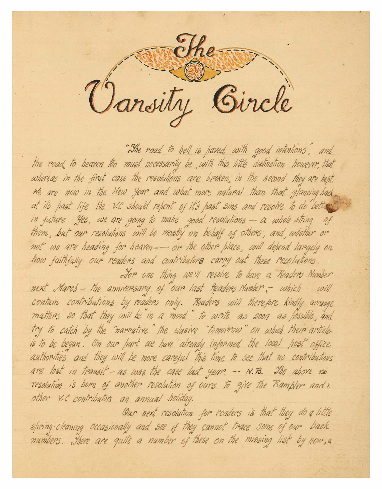

and unless matters improve soon we will be constrained however reluctantly
to rally together our V.C sleuths from all other directions and put them on
the job. We have not yet got a complete list of the missing magazines, but we
hope to within a month. Perhaps before that time sone of our readers will
think of dusting their book shelves, and start making discoveries.

Our third resolution will be for V.C contributors, and
we'll resolve for them that they will commence their articles for the February
Number today -- NOW, and hand it over to us tomorrow.

And as for ourselves we truly and solemnly resolve
that in spite of all impediment and drawbacks, and all foreseen and
unfore-seen circumstances we shall and will and must get our
January Number our before the 28th of February 1933.

---

Life is a horse
    With a bridle and bit --
It will drive you
    If you don't drive it.

---

GOLDEN RULE. 1933 Version: "Expect to be done as you would
                            like to do others.

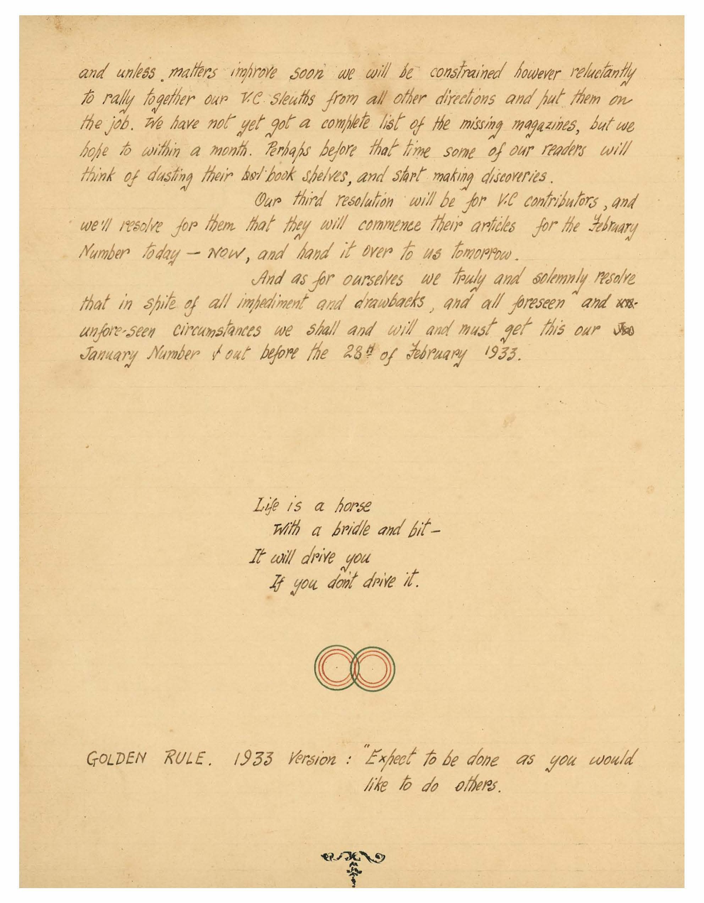

# The Rambler

What do you say, dear reader to rambling about the
ways of parting. No, I am not thinking about the ways and means of parting
company with you and the V.C; that I'll only do if I get a better opening else-
where. But we shall consider in this short article (it has got to be short, because
I have not much to say) the different manners in which people enjoy each others
company. I have yet to come across the man who can part with me without
lingering, not that I am very plesant company, but I have such a knack of
sticking on to people that they cannot but stay on. I usually chat longer than is
necessary and when I get up to go, I always expect my host to accompany me to
the door; and at the door usually some topic of the other crops up and we fall
to talking for another half-hour or so. He then comes to leave me at the golden gate,
and at that place we again make station until in the end he actually tears
away from me or I from him (This latter of course is very rare).

Often times I go to a friend and declare most solemly
that I must leave him in half an hour; but that half hour passes and yet I can-
not part, for, if the company is interesting  I like to stay on, and if it is not, then
I would like to make it pleasant before I leave it. Thus I often stay on and make
the pleasant dull by over-indulgence, or, if unpleasant already I only succeed in
making it still more so. No, I am not a bore, and often my companion too
like to be longer with me.  But of course you have a right to form what-
ever opinion you like of me and if I bore you as 'The Rambler', you may
call me so.

And now, since I have promised to be short I must
close up my shop for the present; but as far as possible I always like to part
with a joke and at present some four jokes come to mind. I am not in a
mood  to sit and select the best of them, and besides, giving all the four will
fill so much more space. It is the raining season now and a school boy might

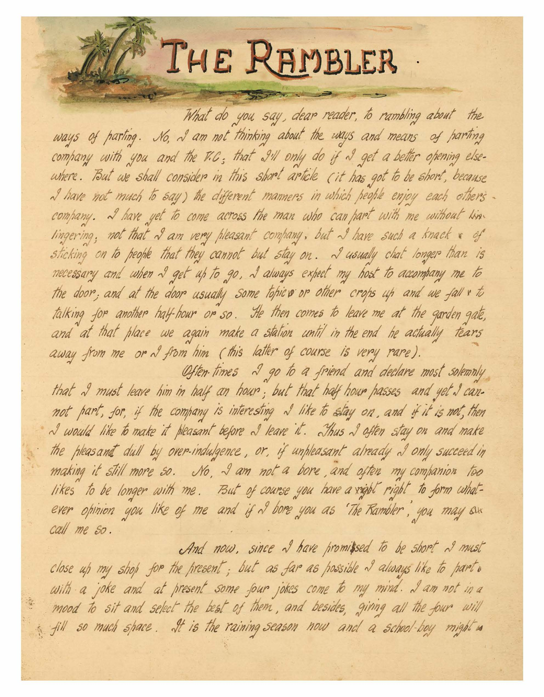

well come dripping wet to class in the hope of a holidy. Once such a boy
was asked why he had not used his umbrella and he replied that he wanted
to defy the rain; so the teacher asked him to defy the wet clothes and stay on.
But let us come to regard the most interesting subject in the
world, woman (the subject is an interesting one for men, of course). There
was a certain gentleman of my acquaintance who used to pass on his
books one after another to his sweet-heart  (who of did not recognise him
to hld the same reciprocal relation to herself), and when asked his
reason for doing so, replied that he wanted his books to be consecrated by
her touch. I cannot end this series of jokes bettern than by telling you that
the philosopher has been defined as a blind aman in a dark room, trying
to find a black cat is not there!

                                                The Rambler.

It is a hopeful sign, remarks one surveyor of the present situation that
millionaires have ceased to multiply. We'd like it even better though if they'd
begin to divide.

---

Boiled down, Japans grievance against the Chinese is that they occupy China.

---

"There is too much love in fiction" says a litary critic. Judging by the
large number of breach-of-promise cases, the reverse is also true.

---

"Poverty-Stricken Count Weds Untitled Heiress"--- Headline. ... No Imagination.
The headline should have read: "A Count marries Account.o

---

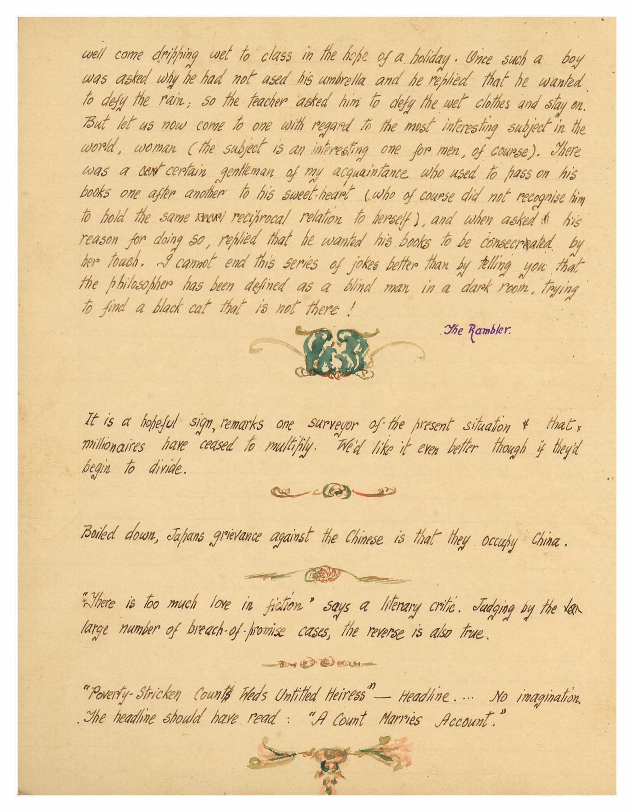

# OUR DIARY 

                                Friday 1st January 1932

So, the new year has come at last. What has it in store
for us? Time alone will reveal. Perhaps it will usher in a period of renewed
prosperity; perhaps on the other hand it will only accentuate the misery
and suffering of the past year.

Times are indeed bad! The past few years have been lean
years for all, every succeeding year worse than the other. Will this year be another
in the chain of bad ones, will it be yet another, yea, and a worse phase of the hard
times which have been so persistently dogging our very footsteps, or will it be one
that will break the string and stand out as the turning point in the fortunes of the
world. Prosporous times will not visit one nations and pass over another. It goes againt
the very grain of things, -- against the law of nature for we are so dependant upon one
another for the necessities of life that ther can be no prosperity, except it be
general. Treaties and pacts may be made ad.libitum, tarrif walls may be build as
high as ever, yet ther is a lay governing these things which will last for ever - a law
which in it's own good time will effect an adjustment in the affairs of men and ^[of] nations

I'm not thinking of socialism, nor do I vision a common -
wealth of nations. No, nations will retain their identity as long as the people that go
to make them retain their individuality. There is no need for an amalgamation of the
world for world peace and prosperity.  The trouble today is that we are all suffering
from an acute depression, and all suspecting one another of being the cause of it. Let
times improve  and then our relations with one another will also improve. And then, when
good times have at last arrived round the corner, let our politicians and economists and
trade magnates go cautiously. Let them remember that the present chaos is the result of
their own folly and recklessness and want of foresight, and let them beware of falling into
the rut again. Let them build up their resources with the future well before them, and not
think only of the present -- the immediate present.

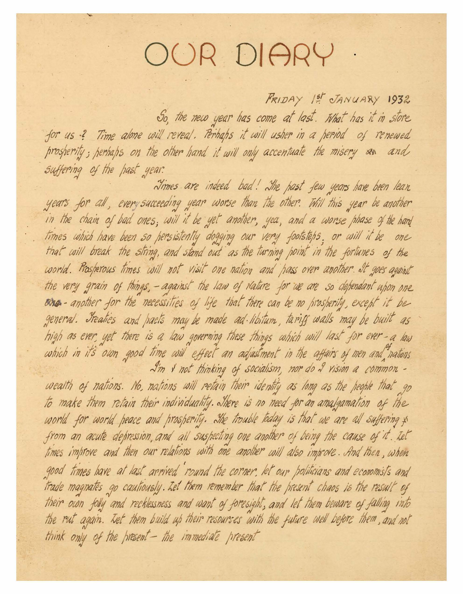

---

So They Say
===========

Whatever other purpose the recent Academy held by the Men's Sodality of
St. Peter's has served, it has proved beyond the vestige of a doubt that there
are quite a number of celebrities in Bandra who have missed their vocations.

---

An employer says labour wouldn't be satisfied with the five-day week.
Maybe the movement will eventually be for a five-day week-end.

---

For original ideas we must hand it over to the Bandra Municipality,
Who else could dream of cultivating water-plants in one half of a 'tank'
and use them to reclaim the other half.

---

At last the world has arrived at equal division of capital and labour.
Nobody can find any work, and nobody has any money.

---

The January 1st Number of the 'Standard' was not out until after
the 15th of the month. If this state of affairs continues the V.C wil be
constrained to sue them for infringement of patent rights.

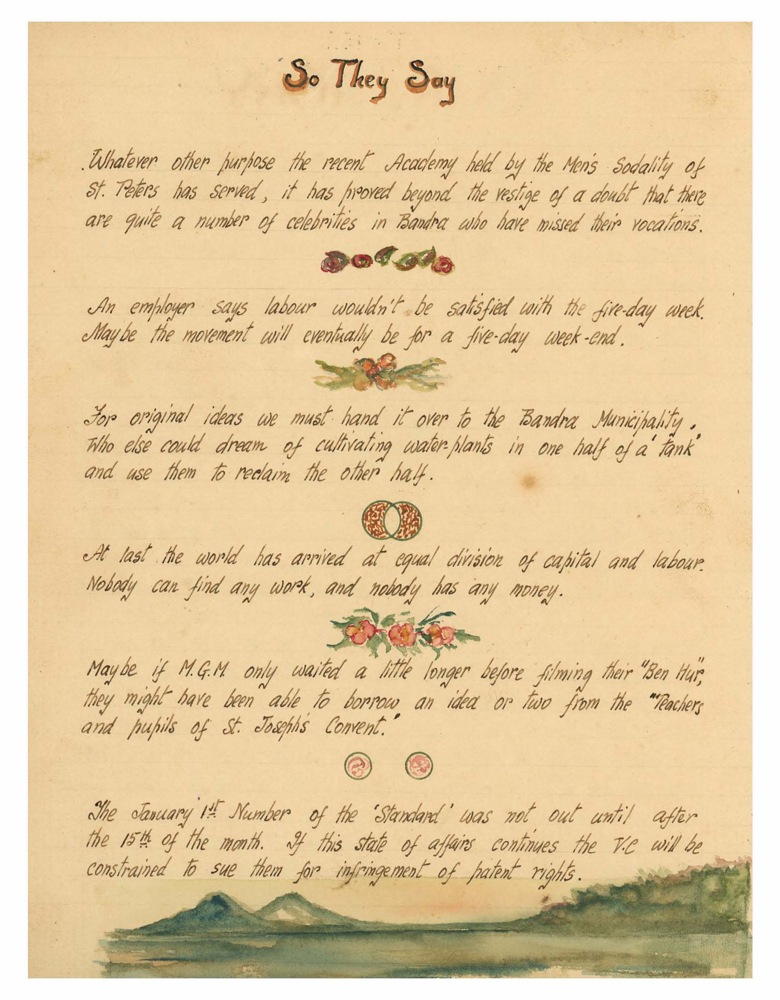

THE CINEMA
==========

"The curse of mankind ,  the plague of humanity, the eye-
sore of society, the mockery of decency, the shame  of civilization"--these
and many other such abuses have been heaped upon the Cinema. This creation of
modern science has been misused and abused till it's primary function is
scarcely recognisable.

Fresh from the recesses of unknown laboratories of the
world's scientists this child of inventive brains was brought into the world mainly
for educative purposes; but snatched from it's home and it's poor surroundings,
to fill their overflowing coffers, by pandering to the low taste of millions who
what filth and were willing to pay for it.

But Truth has risen triumphant and the censor has
done much to stamp out the evil, aided by an enlightened public , who, after the
gloss  has been rubbed off, have realised that the broadmindedness need not include
indulgence of imorality and Art need not be mere sensuality.-

The Cinema is slowly but surely regaining its lost place
in the Scientific and Educational world. Never in its life of a score or more
years have producers been so eager to have pictures of educational value and
interest, than when they spent millions of dollars, and years of labour to give us
the unique opportunity of hearing "Africa Speak" or of following "Trader Horn" through
desert wastes and jungle wilds, nay even of taking us to the "East of Borneo",
or of making us live the lives of our ancestor "Tarzan the Ape-Man" Need
further proof be given of the realization of this craving in the Public Mind for
such educative films, when the Fox Corporation, M.G.M., Paramounts and Columbia
are all vying with one another for the best production in this sphere

But why restrict ourselves to mere educational films. I 
take it that you have seen the immortal "Ben-Hur"; need we a Gandhi to

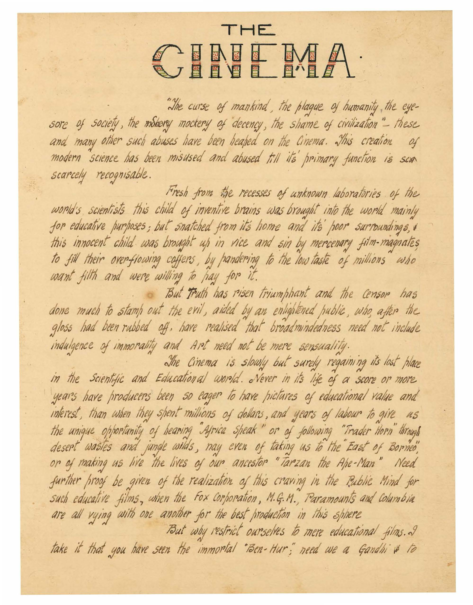

inspire us with patriotism when those four word vibrate our very
heart-strings - "I am a JEW." And with Jackie Cooper in the "Champ" need
we even the Commandment "Honour thy father and thy mother." Nay, Nay, leave 
these outstanding mighties on their pedestals, and come to the lower order. Shall we
see "All Quiet on the Western Front" to realise the folly of our ways and the useless-
ness of rank hypocrisy: shall we spend the evening with the Vagabond King and
learn from that beggar-monarch that an ideal in life can do more than a thousand
precepts or sermons; that a kind deed and a gentle word of understanding and
sympathy can accomplish what months of imprisonment  and torture would only
make more difficult to achieve.

Where shall we go, whither shall we turn? Speak you
of repulsive bathroom scenes and half naked chorus-girls, not to refer to bed-room
scenes that show bad taste? These things must be! Leave them to themselves,
and they too shall soon take their turn to oblivion; you have even now a fairly
good variety to choose from.

Shall we step in to learn the psychology of husbands
from the "Husband's Holiday"; or shall we see the evils of bribery and corruption
in our judges and guardians of the law in "Night Court"? Would you prefer
to go "Round the World in Eighty-Minutes," or perchance to "Just Imagine yourself
living in 1980.

Shall we leave these for other folk and turn to the lighter
Metrotone News and hear the Native Savage of the Fiji Isles sing on their moon-lit
shores or gaze upon the glamourous Hava dancing languidly under the
swinging palms. Would you like the Pathe Gazette with a special supplement
of the Derby, or Paramounts' special the "Final Test Match" or British Movietones'
"The Great Boat Race? Why not try a ride in Fox's Magic Carpet and fly round
the world over the tops of Egypt's Pyramids, or over the mighty rush of the
Niagra Falls, of float over Everest's peak unconquered yet, or gaze down
Etna's crater slumbering still? All these and more are at your beck
and call; behold the work of Man!

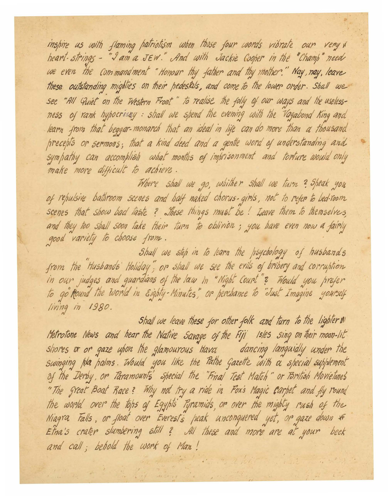

Uh, I forgot! You are a lover of Nature. Well, well,
shall we see how the King Butterfly is born or would you have the Queen Bee
reign amidst the drones? Maybe that wont satisfy you either. I must say
you are very difficult to please; anyway I'll try another change. Ha, ha! how
you recoil! Why, such things actually happen: surprised are you? 'Tis but
one of the millions of filthy hutsand vermin hot-houses that exist in India today.
The people who live in them scarcely realise the danger and those who are in the 
know care not to help them. And now you are seeing the havoc that a single Fair
in India can do, when scores and scores are swept away be Cholera, and
what's worse, -often Plague.

And now you say "Stop", and stop I surely will,
but not before you admit that you are satisfied, be it in Comedy or
Tragedy, Romance or Adventure, we shall still find enough therein to satisfy
our craving for intellectual recreation. And now with the Talkies can we
want more? Swept off our feet by a Jeanette Macdonald or thrilled to action
by a Tibbet; set a-tingling by a Chavelier, or dreaming old-time dreams with
the Gaynor, we might well fear with Shakespeare that "surfeiting, the appertite
may sicken and so die".

                                                        A.P.Periera.

---

An astronomer says that as stars grow older they decrease in weight.
Quite obviously this astronomer knows little of Hollywood.

---

A writer says that mariage does not prevent a woman public speaker
from pursuing her career. On the contrary, it means that she has
provided herself with a permanent audience.

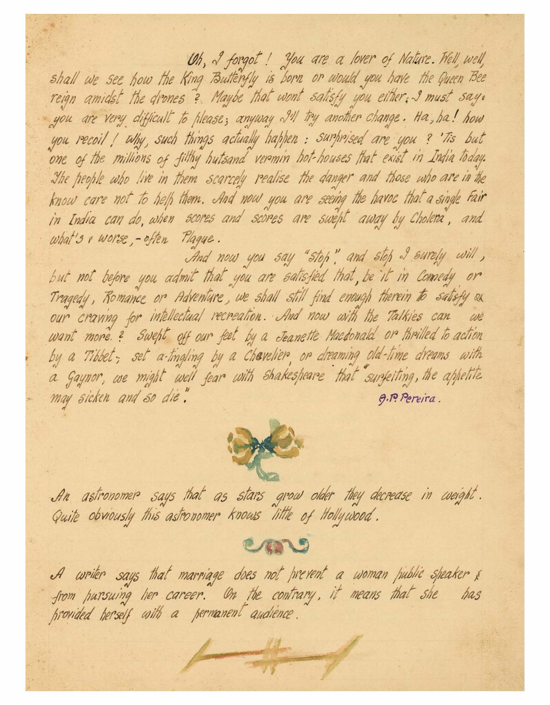

YE MUSES
========

Here are the things I mean to see
(with luck) in 1933.
    I'll rise beninant, wise and strong
    Before the second breakfast gong.
And if the morn not too murk,
Will strive to do a spot of work,
    'Ere the impatient clocks suggest a
    Light luncheon and a short siesta.
I'll struggle with my dull routine,
Till 4 or even 4.15,
    And hie me straight to home and grub
    (After a fluttern at the Club).
For a dinner I will be content
With seven courses (six in Lent).
    I'll smoke (for I have high ideals)
    Only before and after meals.
And (barring whiskey and champagne)
From wine and spirits I'll refrain.
    My spouse shall have a final word,
    Save when I'm certain she has erred.
True to the ancient apophthegm,
I'll be in bed by 2 a.m.
    And, if I'm very, very ill,
    I'll let a lawyer draft my Will.

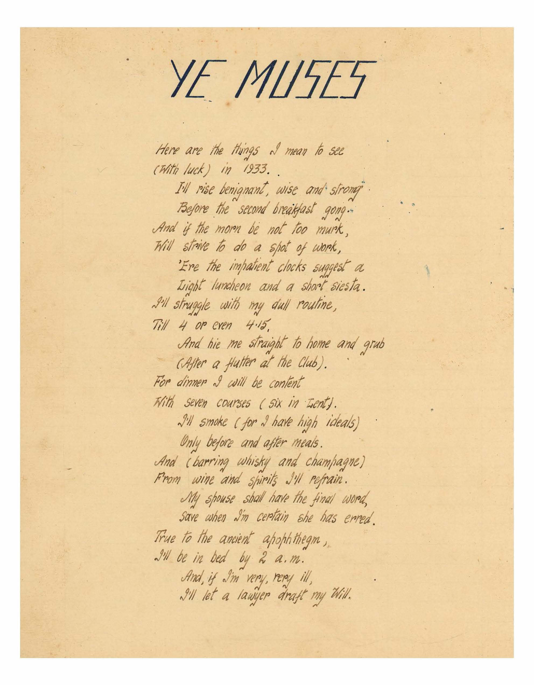

The Machine
===========

"Let the show-maker stick to his last" is a saying which
has without doubt stood the test of ages. Still, the show-maker cannot always be
making shows. For a change, as much as for recreation and diversion he may take
to something else; for instance he may learn to play the saxaphone, and, if in his
first attempts he sets the neighbourhood on edge with ghastly sounds resembling a
cat and dog fight, we shall not be too hard on him shall we?

So far I've mostly contented myself with writing on frivolous
subjects, and I must confess Id never have thought of going off the groove were
I not at this moment rather hard-pressed for a subject. To be honest I'm never
at my best on a serious topic, but I'm going to see this through even if it costs
me my present self-esteem or my past reputation. At the worst my attempt will
be a miserable failure but on the other hand, it's success will open out to
me new walks of life and fresh avenues of research. The attemp is worth the
stakes, and I'll make it.

And, having come so far som of my readers may perhaps
think that I'm just making much ado about nothing. -- I am! Being just now
in a very confidential mood I dont mind admitting things (still there's a limit,
and certain intimate questions would not even now evoke an answer) and I'll say
this, that I'm merely trying at present to fill the pages at all costs because I
am afraid I wont have enough to say on the subject I have chosen for my article.

The subject I have decided to write upon is "The Machine".
It is a topic which is very widely discussed at the present moment and it was
a recent statement of the "Rambler" relative to it which turned my mind in this
direction -- although  I wil not say that I never thought on the matter before

Of course, were it not for the trade depression -- for this
aweful business slump, the like of which has never been experienced before, the
machine would scarcely have come to be the subject of such a universal discussion.
Slave as it was meant to be, it would have continued to work for and enrich

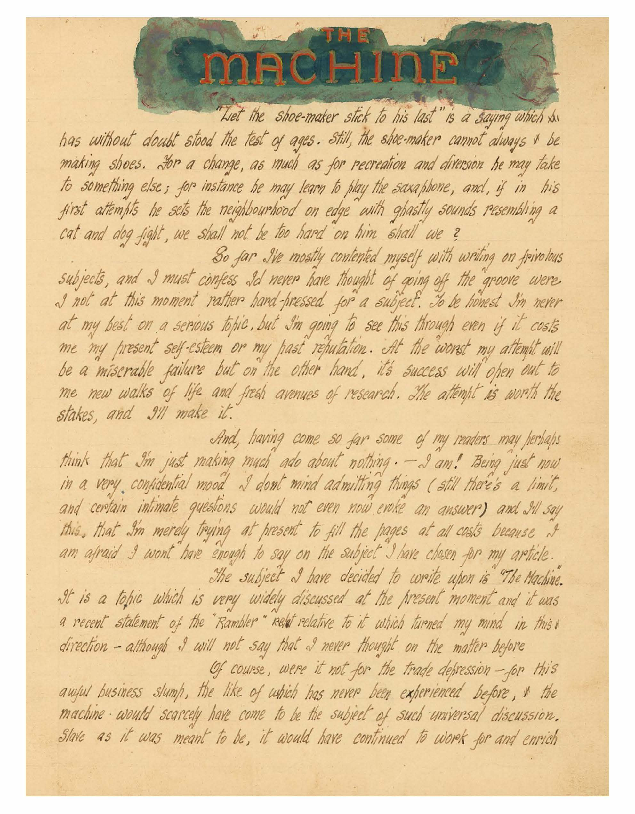

it's masters, and nobody would have given it even a second thought. Such has been
our actual experience in the days of our prosperity not many years ago. Then the
machine was never thought of except as a labour-saving device and a means of making
millionaires and multi-millionaires. That was when the machine was fulfilling it's
functions, or, to be more correct -- when current conditions made it appear  so, and
people were deluded into the satisfaction that all was well and normal.

But things are different now. Conditions have changed and
dreams have been shattered, and we now find ourselves heading towards a state of
affairs that is every day becoming more and more impossible. As to why these things
have happened I will  not even pretend to answer. The matter is beyond me -- nay,
beyond even our world economistsl, for, the very continued existence of the trouble
for such a long time now is sufficient proof that they dont know either what
is wrong with business, or how things could be improved. However, be the reason
what it may, here we are in the very depths of an industrial depression of
unprecedented dimensions, and among other things the maching is blamed for the mishap.

The charge against the machine is three-fold. In the
first place it is contented that the machine is the cause of the over-production
which is claimed to be at the bottom of the present economic break-down; in the
next, the machine is blamed for throwing thousands of men out of employment,
men who, before the advent of the maching could always find some work to do.
And finally it is said that the machine is the cause of the unequal distribution of
wealth which has in so many countries had a reaction in the shape of chronic
class hatred and communistic drives.

Still, when one looks back through the pages of history,
one cannot help but take a more optimistic view of the present state of affairs
and realise that with but a clear-thinking and right-doing, all will yet come
right. Away back in the nineteenth century when the hand-looms were replaced by
the efficient machinery which threw thousands out of employment and earned the
opprobrium of whole communities, men were as pessimistic about the future
economic situation as they were at the present time. But their fears were soon

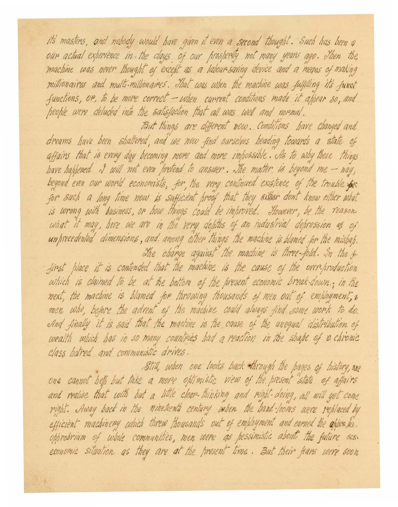

to be allayed, for, instead of increasing unemployment, the textile industry did an
unthinkable thing -- it gradually created more jobs and absorbed more of the
population. And the cause of this seeming miracle was not difficult to find.
Efficient machinery meant reduced overheads, cheaper products and consequently more
extensive markets. The increased demand meant increased production which in turn
meant wider employment, and thus the circle was complete. But there was one
flaw in the system, a flaw which was not noticed then, not because it was less
of a flaw, but merely because there were other conditions counter-balancing or
rather concealing it, and otherwise preventing it from being seen uin all it's
reality -- but of this later. After all, labour-saving devices need not mean
unemployment, and the revolution which the machine introduced into textile industry
should have thaught us a lesson -- but it didn't.

One of the big reasons attributed by people for the existing
economic chaos is the overproduction of commodities both manufactures and
agricultural products. But "overproduction" is indeed a poor term to use for des-
scribing a state of affairs which is considerably worse than that. Self-deception
unfortunately has always been a characteristic feature of our present generation, and
it is therefore quite understandable that what should properly have been termed
"mal-distribution", should fondly be called "over-production"" and left at that.
All things considered, the world with all it's efficient machinary is yet not able
to cope with the normal needs of the people which though seemingly satisfied
are in reality ver far from it. We must do without a car or wiht one meal
a day not because we dont need a car or are satisfied with but one meal,
nor because there are no eats or foodstuffs to be had, but merely because being
"broke", we simply cannot afford these things although they are there, and
rotting for want of purchasers.

Another big crime of the maching is that it has
taken the bread out of the mouth of thousands of families by driving the
wage-earners out of employment, and for the solution of this difficulty we haven't
to go further than to the very next objection to the machine -- that it only

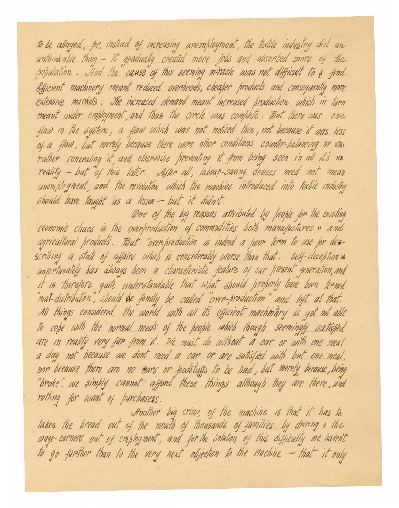

helps to effect a very unequal and unjust distribution of wealth. If we are
able to find a way out of this third objection we will have won a triple victory
for we will then have dound an answer to the other two objections to the machine, as
these in fact are merely the outcome of this unequal distribution of wealth.

This third objection I hardly mention is a real one,
the only one  in fact, for it is the abuse of the machine by profit-seeking capitalists
that has to a great extent been responsible for the present state of affairs. I'm not
so sure of it, but I think one could even be excused for blaming the whole
depression, if not on this abuse of the machine, then at least on the same
human greed and avarice which has led men to exploit the machine and human labour.

It has been a short-sighted policy with regard to the
machine that has worked our downfall. Men thought of the machine not as a
means of benefitting humanity as a whole but merely of enriching themselves at the
expense of those less fortunate mortals who were dependant on them for a living.
Our greed and selfishness has been our misfortune, for, though when conditions were
abnormal, prospects did look rosy, now after years of adjustments we find that
something is wrong somewhere, and while trying every possible remedy for the
trouble we are deliberately blinding ourselves to the one and only remedy
that can effect a sure and a permanent cure.

And, what is this something which is causing the
whole trouble and which holds the magic cure to all our ills? The experience
of the past should have revealed it to us and served as a lesson for the future,
but unfortunately it didn't. Machinery by it's very nature replaces human labour --
is meant to replace it. But machinery also cheapens things to an extent that puts
them within the reach of the millions and so secures a market large enough to
enable more ment to be employed as long as the demand for the product continues,
-- and here comes the crux of the whole matter. The great thing is for the
demant to continue -- not only to continue but to increase in proportion to the
population. Now, as long as the relative wealth of the consumers and manufacturers
can be maintained at a ratio that is conducive to the propserity of both, the

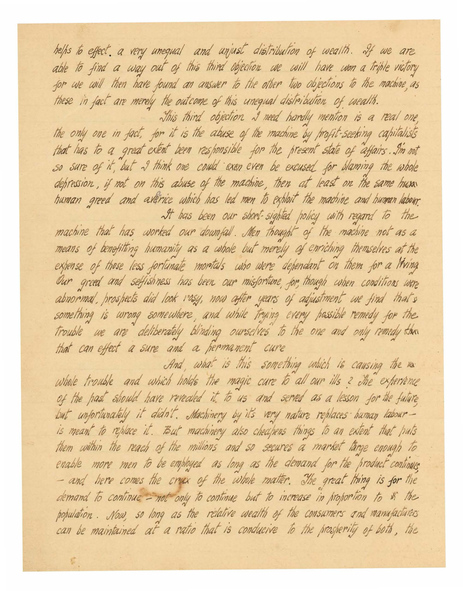

demand must of necessity keep pase with the population. The maintenance of this
ration is by no means an easy matter but it is a result we have to acheive
if we are at all serious about getting out of the rut into which we have
fallen. At every turn we are bound to be faced by complications that would
make the situation seem impossible of solution -- but there never
was any real acheivement without a corresponding struggle.

Still, while it is all-important that we preserve this
ration of wealth between the employing and the wage earning classes, it is all
the more important that the wealth of the latter should be spread over as
many workers  as possible so that the greater proportion of the wages will be
returned to circulation and keep business going. This plan will mean reduced
wages by all means but that only in the initial stages, for, as the movement
gains momentum, conditions must eventually improve with the result that
wages in all probability will even rise to higher levels than at present. But
this is not all that must be done if continued prosperity is to be achieved.
Ager all the Machine does not exist solely for the benefit of capitalists and
millionaires. The working class have a right to a greater share of it's benefits
than falls to their log at present and the sooner this fact is realised the
better both for them and for their employers.

When all is said, the Machine stands for saving in
time. We want more leisure, but we want leisure while still retaining our
jobs. The advent of the Machine has without doubt gradually done away with
a lot of drudgery of former days, but is this all it can achieve. Surely
not! The work of the Machine has only just begun. It's ultimate mission
is a unique one, for it's sole purpose will be to provide as much enemployment
as  possible for the employed. Things have now come to a pass when we
must provide work for as many workers as possible
by giving less hours of work and more of leisure. After all,
if civilization is to make any real progress we must try and arrange matters so
that the education of the masses will be a matter more easy attainment

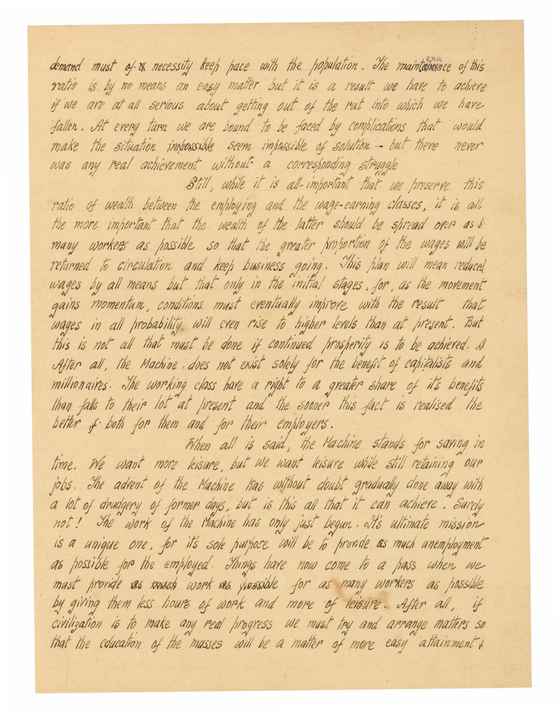

than at present, and the only conditions under which this is possible is more
leisure and sufficient wealth.

Reduced hours of work -- that is what we must work
for, and when we have got it in a sufficient degree we will bo on the high-road
to an ideal state of affairs -- a veritable era of prosperity with no more fear of
hard times. At the outset this will mean a sacrifice to employers but it will
never-the-less be a gilt-edged investment with promises of big returns. It will mean
employment not only of men but of money too -- money which at present is idle
while millions are out of work and starving.

And more leisure for the millions will mean a wider
outlook for them, more interests in life, and more "outside" occupation, new needs, and
new demants. And to cope with these demands new industries will spring up, more
hands will find employment, more wealth will be distributed and re-distributed,
and man will have reacheed the zenith of his ambition -- the betterment of the human
race in general and the establishment of mutual relationship between the two now
conflicting classes -- Capital and Labour!

                                                                -- A. Rodrigues
---

Our politicians are perfectly familiar with all the questions of the day. The
difficulty is that they don't know the answers.

---

Science tells us now that life began in a few puddles of hot water in a
polar depression. And the depression and the hot water are still with us.

---

Insects, says an eniment entomologist, compete with man for the food
supply of the world. But even that wouldn't bother us so much, if they
didn't go and regard us as part of the food supply.

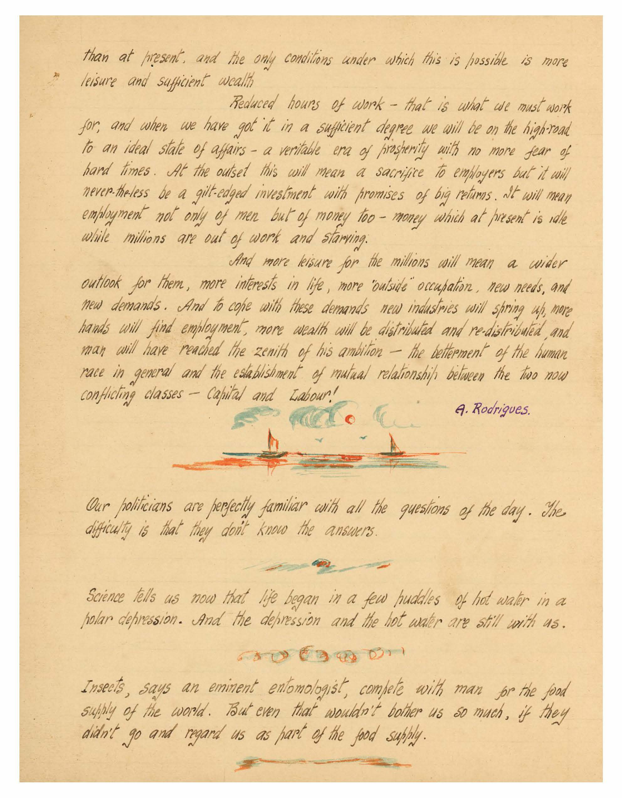
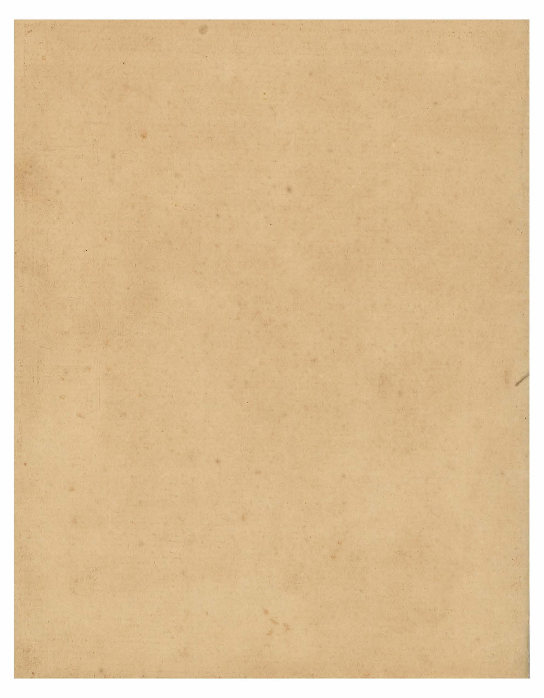

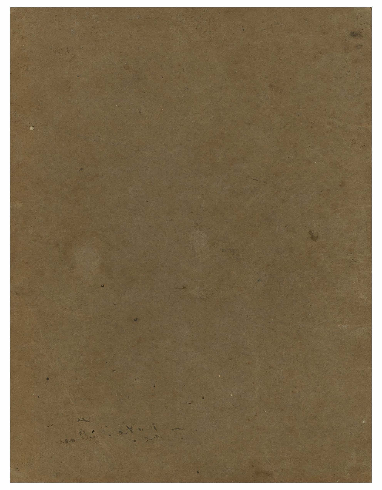
